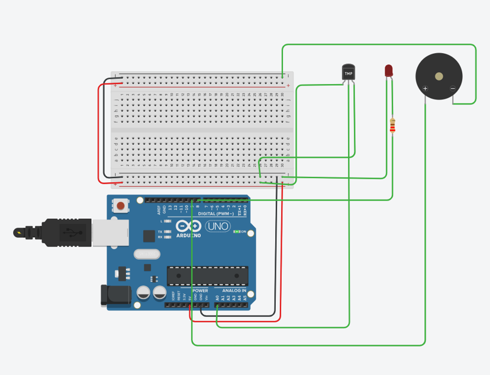
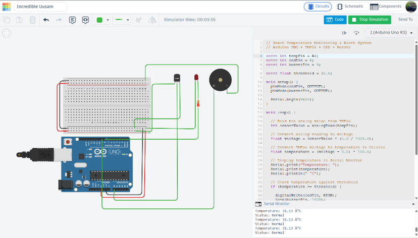
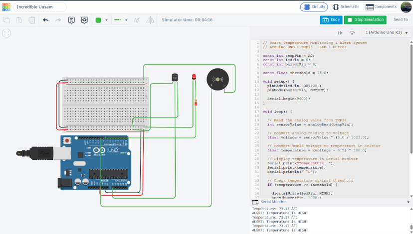

# Smart Temperature Monitoring & Alert System

## Overview

The Smart Temperature Monitoring & Alert System is an Arduino UNO based embedded system that monitors temperature using a TMP36 temperature sensor.

The system continuously reads the temperature and compares it with a predefined threshold of 35°C. If the temperature reaches or exceeds 35°C, an LED and buzzer are activated to provide an alert.

The project was designed and tested using Tinkercad Circuits simulation.

---

## Objectives

- Measure temperature using the TMP36 sensor.
- Process the sensor data using Arduino UNO.
- Display the temperature through the Serial Monitor.
- Compare the measured temperature with a 35°C threshold.
- Activate an LED and buzzer when the temperature is high.
- Demonstrate basic sensor interfacing and embedded system programming.

---

## Components Used

- Arduino UNO R3
- TMP36 Temperature Sensor
- LED
- 220 Ω Resistor
- Piezo Buzzer
- Breadboard
- Jumper Wires

---

## Working Principle

The TMP36 temperature sensor produces an analog voltage according to the surrounding temperature.

The Arduino UNO reads this analog signal and converts it into temperature in Celsius. The measured temperature is then compared with the predefined threshold of 35°C.

If the temperature is below 35°C, the system remains in the normal condition with the LED and buzzer OFF.

If the temperature reaches or exceeds 35°C, the LED turns ON and the buzzer sounds to indicate a high-temperature alert.

The system continuously monitors the temperature and updates the status every second.

---

## Program Logic

1. Read the analog value from the TMP36.
2. Convert the sensor reading into voltage.
3. Calculate the temperature in Celsius.
4. Display the temperature on the Serial Monitor.
5. Compare the temperature with the 35°C threshold.
6. Activate the LED and buzzer when the threshold is reached.
7. Keep the LED and buzzer OFF during normal conditions.
8. Repeat the process continuously.

---

## Testing and Results

The project was successfully tested using Tinkercad Circuits simulation.

During normal testing, the system displayed a temperature of **31.13°C** and showed the status as **Normal**. The LED and buzzer remained OFF.

During high-temperature testing, the system displayed **73.17°C**. Since this temperature exceeded the 35°C threshold, the LED turned ON and the buzzer was activated. The system displayed a high-temperature alert.

These tests demonstrate that the system correctly monitors temperature and responds when the predefined threshold is exceeded.

---

## Circuit Diagram

---

## Normal Temperature Condition

The system shows a normal condition at 31.13°C, with the LED and buzzer OFF.

---

## High Temperature Condition

The system detects a high temperature at 73.17°C and activates the LED and buzzer.

---

## Applications

This type of temperature monitoring system can be used as a basic concept for:

- Server room temperature monitoring
- Industrial equipment monitoring
- Cold storage monitoring
- Greenhouse temperature monitoring
- Battery and electronic equipment monitoring
- Smart home temperature monitoring
- Laboratory equipment monitoring

---

## Tools Used

- Arduino UNO
- TMP36 Temperature Sensor
- Tinkercad Circuits
- Arduino C/C++

---

## Project Type

**Embedded Systems & IoT Device Design — Task 1**

## Internship

**Maincrafts Technology Virtual Internship Program**
